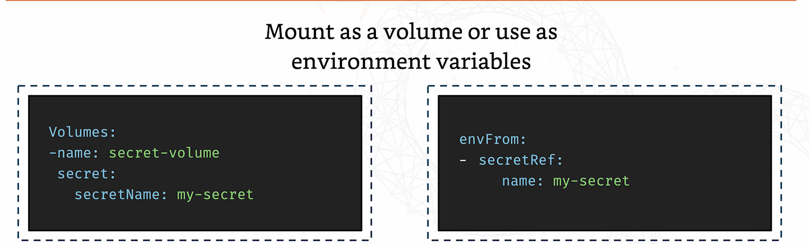

# DevOps-Learning-Kubernetes
Repository containing commands and topics I learnt in the CoderCo Kubernetes Module.

## What is K8s and why we use it?
- Kubernetes is container orchestration tool that assists in deployment, scaling and management. 
- Large open-source project

## K8s Architecture
- Cluster: a collection of nodes that provide compute, memory, storage and networking resources. Kubernetes uses these resources to run the various workloads. Your infrastructure may consist of multiple clusters.
- Master Node: The brain of the operation. Controls everything in the cluster. Consists of:
    - Kube API Server: The entrypoint for all administrative commands. When you tell kubernetes to deploy applications, the API server is the component that makes it happen.
    - ETCD: Like the memory. Stores all the cluster data and the state. If anything goes down, Kubernetes checks etcd for what is supposed to be running and where.
    - Kube Controller Manager: The cluster supervisor, ensuring the desired state of the cluster matches reality. If something goes wrong, it steos in to correct it.
    - Kube Scheduler: The match maker of the cluster. It decides which worker node your new pod will be running on based on resource availability. 
    - Cloud Controller Manager: If you are using a cloud based kubernetes provider, then you will have this. Connects your cluster to your cloud provided API to handle things like load balancing, storage, networking and so much more. 
- Worker Nodes: The hands on workers of the cluster. They actually run your applications. These consist of:
    - Kubelet: An agent that talks to the master node, making sure containers are running as they should be. If a pod needs to be spun up, the kubelet handles that.
    - Kube-proxy: Handles the networking side of things. Ensures that each pod in the node can communicate with other pods in the cluster no matter where they are running. 
    - Pod: The smallest unit in kubernetes. They are like wrappers for containers. A pod can contain one or more containers.

## Kubernetes in Docker (kind)
- To create a cluster, create a yaml file which contains the below
```
kind: Cluster
apiVersion: kind.x-k8s.io/v1alpha4
nodes: 
- role: control-plane
- role: worker
- role: worker

```

- To deploy the cluster, run the following command 
```
kind create cluster --config name-of-file.yaml --name cluster-name
```

- To view the cluster run the command
```
kubectl cluster-info --context kind-name-of-cluster
```

- You can check the nodes by running `kubectl get nodes`

- Once you have the nodes set up, you can run pods on these nodes by running the command:
```
kubectl run pod name_of_node --image=container_image
```

- You can check the pods by running `kubectl get pods`

- To create a deployment, run the command:

```
kubectl run deployment name_of_node --image=container_image
```

- You can check the deployments by running `kubectl get deployments`

- To delete the cluster, you run the command:

```
kind delete cluster --name name_of_cluster
```

## Pods

A pod is the smallest unit of work or resource found in kubernetes. Each pod contains one or more containers. Containers in a pod are always scheduled together (run on the same machine). All containers in a pod have the same IP address and port space, meaning they can communicate using a local host. All the containers in a pod have access to a shared local storage on the node that is hosted in the pod. Containers do not get access by default to local storage, volumes must be explicitly mounted to each container on the pod. Pods can be defined in a definition file as can be seen below;

```
apiVersion: v1
Kind: Pod
Metadata:
    labels:
        run: nginx
    name: nginx
Spec:
    containers:
    - image: nginx
      name: nginx

```

To run the definition file, we run the command

```
kubectl apply -f name_of_file.yaml
```

If we create a pod imperitively (through the command line), we can view the actual yaml file created by the command by running the command `kubectl get pod pod_name -o yaml`.

## Deployments
For large scale operations where you need many instances, instead of initialising pods one by one, you would use a deployment. A deployment is a powerful kubernetes controller that lets you manage your application across multiple instances effortlessly.Acts like a project manager. It ensures the right number of pods are always running as specified. You can scale up or down depending on how many pods you need. You can easily pgrade or roll back deployments. The deployment definition file will look like the below;

```
apiVersion: apps/v1
kind: Deployment
metadata:
    name: nginx-deployment
    labels:
        app: nginx
spec:
    replicas: 3
    selector:
        matchLabels:
            app: nginx
    template:
        metadata:
            labels:
                app: nginx
        spec:
            containers:
            - name: nginx
              image: nginx
            ports:
            - containerPort: 80
```

To run the definition file, we run the command

```
kubectl apply -f name_of_file.yaml
```

To create a deployment imperitively, you run the command:

`kubectl create deployment name_of_deployment --image=image_name --replicas=2`

## ReplicaSets
The simplest pod controller is the replicaSet. Ensures ensures a speciffied number of pod instances are running at any given time. If one pod fails, the replicaSet spins up a new one to replace it. Deployments are better as it creates a pod manager behind the scenes as well as comes with features such as automated roll backs and rolling updates. The deployment handles all the hardwork for you. 

## Services
Services allow other users to access deployed pods. They make sure everything that need to talk can do so whether that is external pods or other resources. An application has different groups of pods running, a group for databases, a group for frontend and one group for backend. They need to communicate with each other for the application to work smoothly. Services will allow these groups to connect seemlessly. They allow for applications to be built in a loosely coupled way. You are able to update or scale a part of the application without affecting the other parts. Services use labels to identify the pods they should be connecting. The three main types of services are Cluster IP, Node Port and Load Balancers. 

Services operate on the network layer (level 3) of the OSI model meaning they work with TCP and UDP protocols. Behind the scenes, kube-proxies are in charge, it creates IP tables and routes within this.

### Cluster IP
Cluster IP is the default, it gives a stable internal IP address your pods can use to talk to each other within the cluster. Service only reachable within the cluster. 

### Node Port
Node ports exposes your service on a specific port on each node in your cluster. It is a simple way to make sure a service is accessible from outside the cluster. You have a target port, e.g. port 80, this is the port on the pod your application is listening on. Then you have a service port which is an internal port that the service listens on e.g. port 8080. Kubernetes forwards requests received on this port to the target port on the pods. Then we have a node port, e.g. 30080, this is the port that gets opened in each node (usually a high numbered port). The Node port maps to the service internally. If you want to access the application, you would use http://ip-address:30080.

### Load Balancers
Load Balancers is typically used in cloud environments so without a cluster in the cloud, it wouldn't work. It automatically creates an external load balancer that distributes traffic to your pods. If you create a load balancer, this will create an actual load balancer in your cloud environment. The load balancer will distribute incoming traffic across your pods. 

## Storage
Pods are ethemeral (they can be brought up and deleted frequently). If you are not using persistent storage, all your data will be wiped. This is where persistent storage comes in. It ensures data reliability beyond pod lifecycle. Critical for stateful applications. 

### Persistent Volumes (PV)
A piece of storage that has been set aside specifically for your application in Kubernetes. It abstracts away the underlying storage details (does not need to worry if the storage is coming from local disk, or cloud storage). Created by Kubernetes admins. Once created they are available for use by the pods which can claim them through a persistent volume claim (PVC).

### Persistent Volume Claim (PVC)
Request for your application to your cluster for storage. Binds to a PV. Specify the amount of storage you need and any other requirements like access logs. The cluster will then look for a persistent volume that matches your request and binds it to the PVC. 

### ConfigMaps
Provides configuration settings to pods such as environment variables, URLs or file paths. Good for settings which may change based on environment thus hardcoding isn't ideal. Like a storage box for non-confidential data which your pods can access. 

To create a config map, you can run the command below:
```
kubectl create configmap name_of_cm --from-literal=ENV_VAR1=value --from-literal=ENV_VAR2=value....
```

To view configMaps, use the command `kubectl get cm`

### Secrets
Secrets store sensitive data securely within your cluster such as passwords, API keys etc. Secrets are not encrypted by default but are stored base64 encoded. Kubernetes ensures secrets are only accessible to pods and services that need them. Secrets, like configMaps can be mounted to pods as a volume.

To create a secret from the command line, we can use the command:

```
kubectl create secret generic secret_name --from-listeral=username=myuser --from-literal=password=mypasssecret
```

There are two ways to use the secrets as can be seen below: 



## K8s Networking
- All pods can communicate with all other pods without using network address translation (NAT). what this means is every pod has a unique IP address and they can talk to each other directly using those IPs. 
- All nodes can communicate with all pods without NAT.
- The IP that a pod sees itself as is the same IP that others see it as. 

## Networking Policies
Crucial for controlling the flow of traffic between pods in a cluster, ensuring your applications are secure and communication only happens where it is supposed to. Network policies are a set of rules that govern the communication between pods. Allows you to specify which pods can communicate with each other as well as which pods can connect or be connected from external resources. Without network policies, all pods within a cluster can communicate freely (not always desirable). You define rules using selectors that match labels or pods. There are two main types, ingress and egress. Policies can be used together or separately to control the flow of traffic to and from your pods. 

## Ingress Controller
- Ingress is a way to manage external access to your services. Similar to a router that directs traffic to the right service based on request URL or domain name. It allows you to configure rules that dictate how traffic should flow into your cluster. Configuring an ingress resource involves defining the rules in a file. 
- An ingress controller enforces those rules and manages traffic. It intercepts the ingress rules and makes sure traffic is routed correctly to your services. Without an ingress controller, your ingress is just a set of instructions without anyone to follow them. Examples of ingress controllers are nginx and trafeek. 